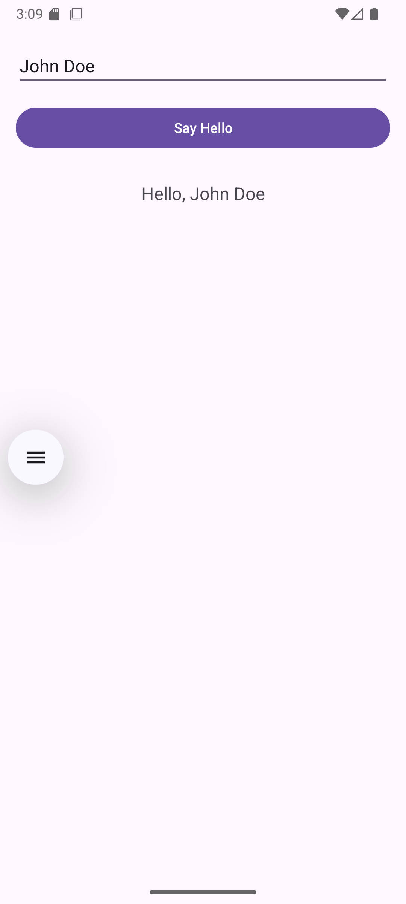

# pm25-week3

## Identitas

- Nama: Wicaksono Hadidul Mannan
- NIM: F1D02310095

## Fitur

- Input nama pengguna
- Tombol "Say Hello"
- Menampilkan hasil "Hello, [nama]"

## Teknologi

- Kotlin
- Android Studio

## Screenshot

 

## Cara Menjalankan

1. Clone repository
2. Buka di Android Studio
3. Klik Run

## File

- MainActivity.kt → Logic program
- activity_main.xml → Tampilan UI
